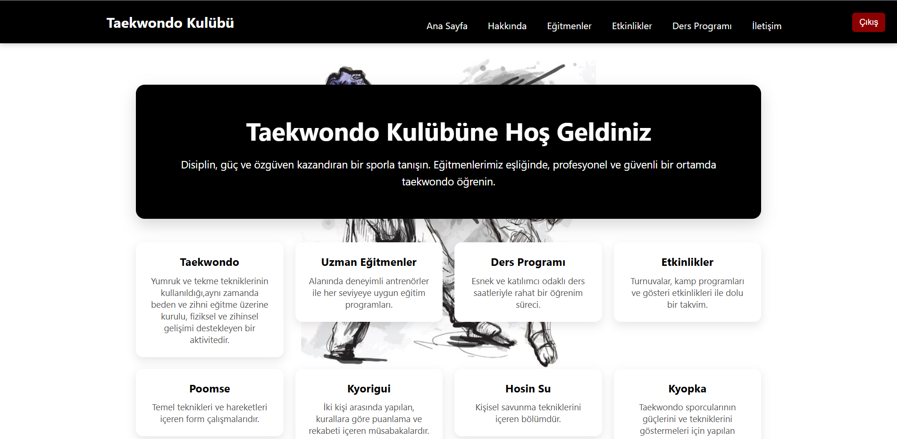
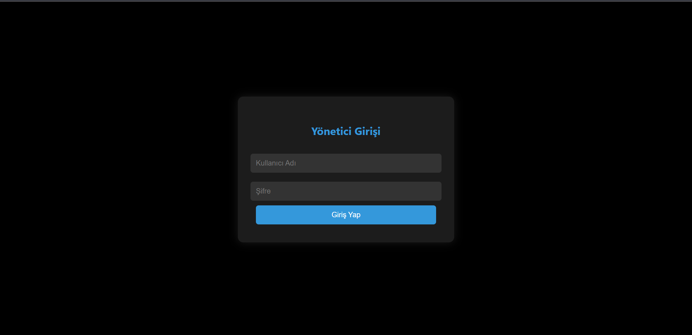
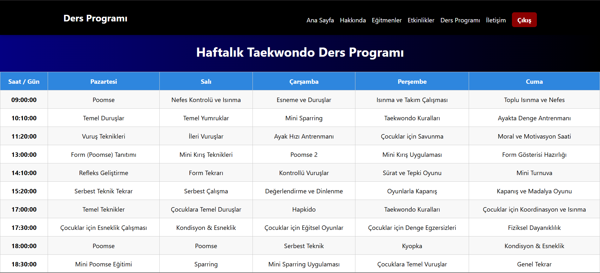
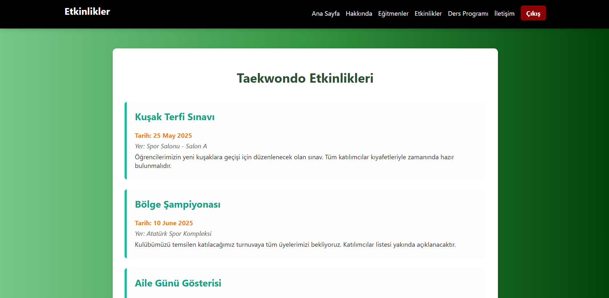
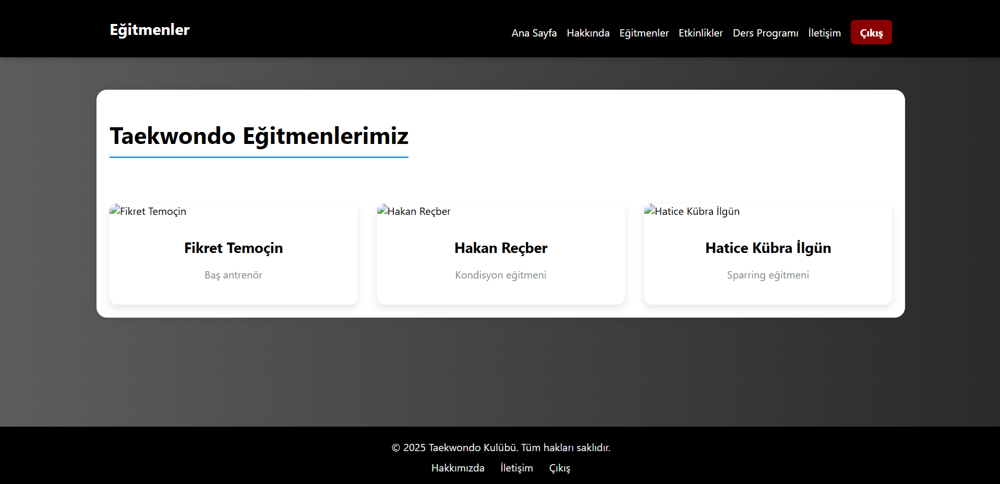
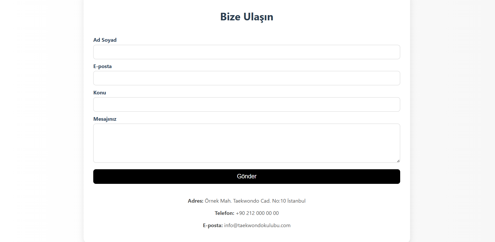
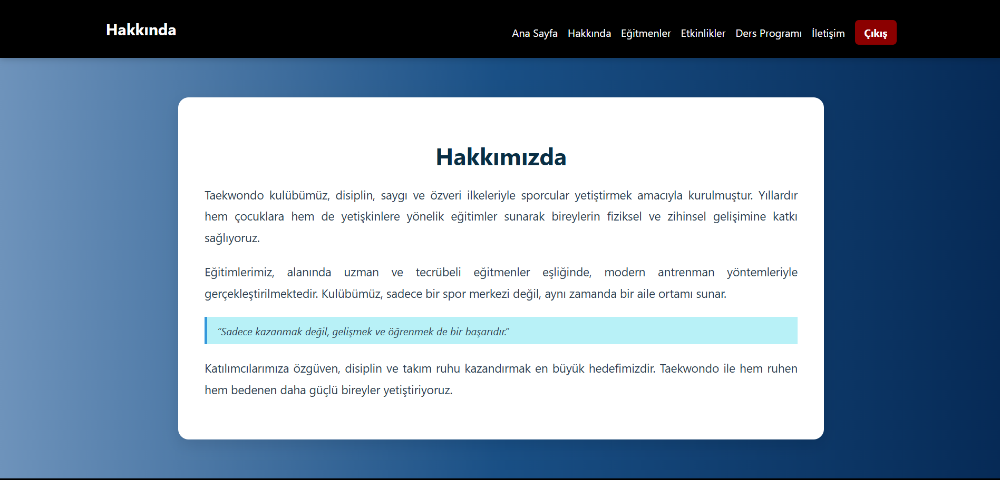
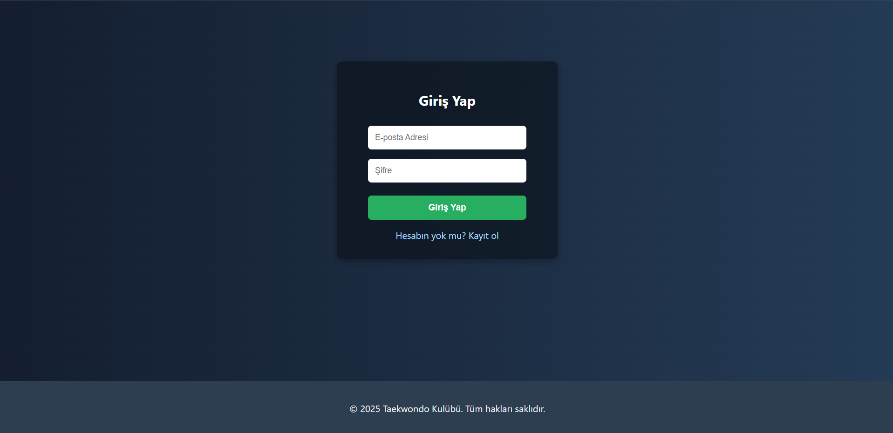
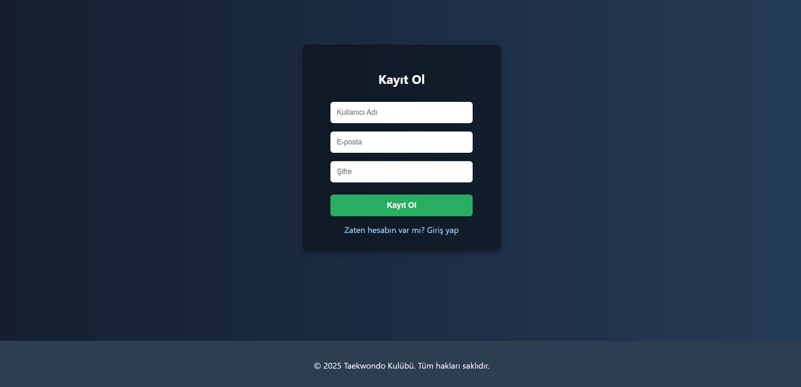

# Taekwonod_Kulubu
PHP,CSS ve SQL ile kodlanmış bir taekwondo web sitesidir.
# Taekwondo Kulübü Web Sitesi (PHP & MySQL Projesi)

Bu proje, bir taekwondo kulübü için geliştirdiğim dinamik bir web sitesidir. Bilgilerin çoğu (Dersprogramı, Etkinlikler, Eğitmenler vb.) yönetici panelinden kontrol edilebilen bir MsSQL veritabanından çekilmektedir.

**Not:** Bu proje dinamik bir PHP uygulaması olduğu için GitHub Pages üzerinde canlı olarak yayımlanamamaktadır. Bu depo, kod incelemesi ve proje portfolyosu amacıyla oluşturulmuştur.

## Kullanılan Teknolojiler
* **Backend:** PHP
* **Frontend:** HTML, CSS
* **Veritabanı:** MsSQL

## Proje Görüntüleri

### Ana Sayfa
 

### Yönetici Paneli 

### Yöneici Giriş Sayfası

### Ders Programı Sayfası

### Etkinlikler Sayfası

### Eğitmenler Sayfası

### İletişim Sayfası

### Hakkımızda Sayfası

### Giriş Sayfası

### Kayıt Sayfası

 # --DİĞER PROJELER--
# Petify Online Phetshop Sitesi

Petifiy adında kedi ve köpek ürünleri satan bir Phetshop E-Ticaret sitesi  
-Gurup Projesi  
-Figma, HTML ve CSS biraz da JS

Petify Online Phetshop Sitesi - Tasarım - Devam Ediyor
-Github Linki
https://github.com/EsmaOner/Petify_Tasarim

-Figma Linki

--Giriş Sayfası

https://www.figma.com/proto/X1ihVHEiID6OZBEtrEXVo0/yeni?node-id=339-6160&t=1McBIfeK8Ee5i7Md-1

--Kayıt Sayfası

https://www.figma.com/proto/X1ihVHEiID6OZBEtrEXVo0/yeni?node-id=339-6134&t=1McBIfeK8Ee5i7Md-1

--Ana Sayfa

https://www.figma.com/proto/X1ihVHEiID6OZBEtrEXVo0/yeni?node-id=6-121&t=1McBIfeK8Ee5i7Md-1

--Kedi Mamaları Sayfası

https://www.figma.com/proto/X1ihVHEiID6OZBEtrEXVo0/yeni?node-id=208-892&t=1McBIfeK8Ee5i7Md-1

